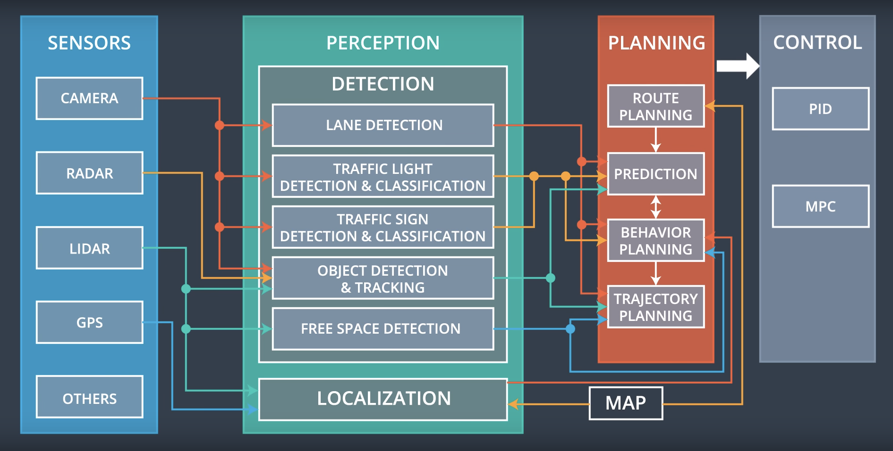
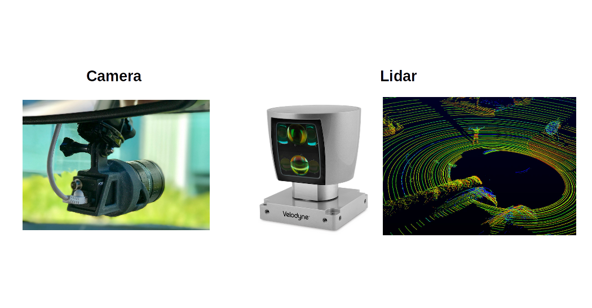

# CarND Capstone Project

## Submitter Info

**THIS IS AN INDIVIDUAL PROJECT - I AM NOT A MEMBER OF ANY TEAM.**
**THEREFORE, I DON'T EXPECT THIS TO RUN ON CARLA.**

## Overview

This is the project repo for the final project of the Udacity Self-Driving Car Nanodegree: Programming a Real Self-Driving Car. For more information about the project, see the project introduction [here](https://classroom.udacity.com/nanodegrees/nd013/parts/6047fe34-d93c-4f50-8336-b70ef10cb4b2/modules/e1a23b06-329a-4684-a717-ad476f0d8dff/lessons/462c933d-9f24-42d3-8bdc-a08a5fc866e4/concepts/5ab4b122-83e6-436d-850f-9f4d26627fd9).

Please use **one** of the two installation options, either native **or** docker installation.

This project attempts `to control a car in Udacity simulator by creating trajectory for the car, responding to the traffic lights status etc`. The car in simulator is being controlled by a few ROS nodes, which is run in Ubuntu 16.04.

## Autonomous Vihecle Architecture:
The vehicle has 4 major subsystems:



In the following, I put very good explanation videos from [Udacity](https://classroom.udacity.com) to learn more about the subsytems.

### The sensor subsystem
Sensors are the hardware components your car uses to observe the world such as cameras and lidar.



### The Perception Subsystem
Learn [here](https://www.youtube.com/watch?time_continue=48&v=zo_JO5Sytuc&feature=emb_logo) and [here](https://www.youtube.com/watch?v=f3qloIYf16k&feature=emb_logo) about the perception subsystem in the architecture of autonomous vihecles. 

### The Planning Subsystem
Learn [here](https://www.youtube.com/watch?time_continue=1&v=MxG9DtKiSqM&feature=emb_logo) and [here](https://www.youtube.com/watch?time_continue=19&v=5c752eVAR3I&feature=emb_logo) about the planning subsystem in the architecture of autonomous vihecles.

### The Control Subsystem
Learn [here](https://www.youtube.com/watch?time_continue=2&v=6pFy9q_AOJA&feature=emb_logo) about the Control subsystem in the architecture of autonomous vihecles.

## ROS
For communications between systems, we use the Robot Operating System (ROS). It is a set of software libraries and tools that help you build robot applications. From drivers to state-of-the-art algorithms, and with powerful developer tools, ROS has what you need for your robotics project. And it's all open source. 
If you are beginner and not familiar with ROS, for learning about ROS, I highly suggest you to start from [here](http://wiki.ros.org/ROS/Tutorials). 

### Importance of ROS for SDC
Once you build a self-driving car (SDC), you often have up to 50 processes running at the same time. Some might even crash while you are driving. So, having a felxible architecture like ROS wrapped around it would be supremely helpful to build scalable software. 

## Simulator
You can download the Udacity Simulator for this project from the [releases tab (https://github.com/udacity/CarND-Capstone/releases).  

To run the simulator on Mac/Linux, first make the binary file executable with the following command:
```shell
sudo chmod u+x {simulator_file_name}
```

### Native Installation

* Be sure that your workstation is running Ubuntu 16.04 Xenial Xerus or Ubuntu 14.04 Trusty Tahir. [Ubuntu downloads can be found here](https://www.ubuntu.com/download/desktop).
* If using a Virtual Machine to install Ubuntu, use the following configuration as minimum:
  * 2 CPU
  * 2 GB system memory
  * 25 GB of free hard drive space

  The Udacity provided virtual machine has ROS and Dataspeed DBW already installed, so you can skip the next two steps if you are using this.

* Follow these instructions to install ROS
  * [ROS Kinetic](http://wiki.ros.org/kinetic/Installation/Ubuntu) if you have Ubuntu 16.04.
  * [ROS Indigo](http://wiki.ros.org/indigo/Installation/Ubuntu) if you have Ubuntu 14.04.
* [Dataspeed DBW](https://bitbucket.org/DataspeedInc/dbw_mkz_ros)
  * Use this option to install the SDK on a workstation that already has ROS installed: [One Line SDK Install (binary)](https://bitbucket.org/DataspeedInc/dbw_mkz_ros/src/81e63fcc335d7b64139d7482017d6a97b405e250/ROS_SETUP.md?fileviewer=file-view-default)
* Download the [Udacity Simulator](https://github.com/udacity/CarND-Capstone/releases).

### Docker Installation
[Install Docker](https://docs.docker.com/engine/installation/)

Build the docker container
```bash
docker build . -t capstone
```

Run the docker file
```bash
docker run -p 4567:4567 -v $PWD:/capstone -v /tmp/log:/root/.ros/ --rm -it capstone
```

### Port Forwarding
To set up port forwarding, please refer to the "uWebSocketIO Starter Guide" found in the classroom (see Extended Kalman Filter Project lesson).

### Usage

1. Clone the project repository
```bash
git clone https://github.com/udacity/CarND-Capstone.git
```

2. Install python dependencies
```bash
cd CarND-Capstone
pip install -r requirements.txt
```
3. Make and run styx
```bash
cd ros
catkin_make
source devel/setup.sh
roslaunch launch/styx.launch
```
4. Run the simulator

### Real world testing
1. Download [training bag](https://s3-us-west-1.amazonaws.com/udacity-selfdrivingcar/traffic_light_bag_file.zip) that was recorded on the Udacity self-driving car.
2. Unzip the file
```bash
unzip traffic_light_bag_file.zip
```
3. Play the bag file
```bash
rosbag play -l traffic_light_bag_file/traffic_light_training.bag
```
4. Launch your project in site mode
```bash
cd CarND-Capstone/ros
roslaunch launch/site.launch
```
5. Confirm that traffic light detection works on real life images

### Other library/driver information
Outside of `requirements.txt`, here is information on other driver/library versions used in the simulator and Carla:

Specific to these libraries, the simulator grader and Carla use the following:

|        | Simulator | Carla  |
| :-----------: |:-------------:| :-----:|
| Nvidia driver | 384.130 | 384.130 |
| CUDA | 8.0.61 | 8.0.61 |
| cuDNN | 6.0.21 | 6.0.21 |
| TensorRT | N/A | N/A |
| OpenCV | 3.2.0-dev | 2.4.8 |
| OpenMP | N/A | N/A |

We are working on a fix to line up the OpenCV versions between the two.

References:
---
https://classroom.udacity.com/nanodegrees

https://github.com/udacity/CarND-Capstone

https://medium.com/@UdacityINDIA/self-driving-vehicles-traffic-light-detection-and-classification-with-tensorflow-object-detection-d6a4d25e99c2

https://darienmt.com/CarND-Capstone/

https://github.com/udacity/CarND-Capstone/releases

How Referencing This Project
---
If you like my code and you want to use it in your project, please refer it like this:

`Amani, Sajjad. "Programming a Real Self-Driving Car" GitHub, 9 December 2019, https://github.com/Sj-Amani/CarND_Capstone`


